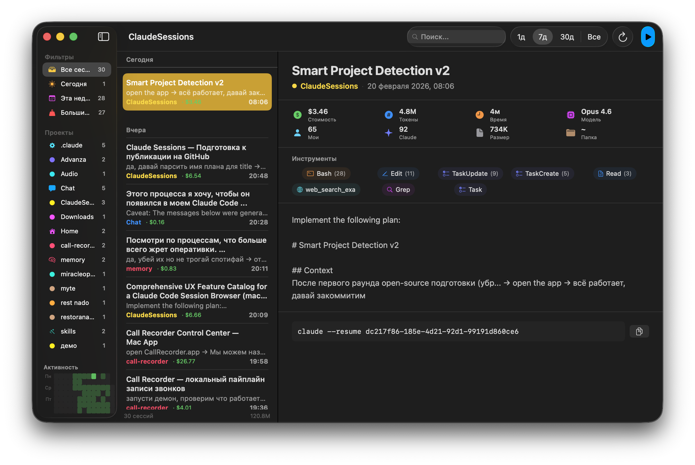

# Claude Sessions

A native macOS app for browsing your [Claude Code](https://docs.anthropic.com/en/docs/claude-code) session history.

  

<!-- TODO: Add screenshot -->
<!--  -->

## What Is This?

Claude Code stores every conversation as a JSONL file in `~/.claude/projects/`. These files contain rich data — token counts, tool calls, model info, costs, durations — but there's no built-in way to browse them.

Claude Sessions is a lightweight SwiftUI browser that turns those raw files into a readable, searchable interface. Think [NetNewsWire](https://netnewswire.com/), but for your AI conversations.

## Why?

Claude Code is a CLI tool. It has `--resume` and `--continue`, but no way to:
- See all your sessions across projects at a glance
- Know how much each session cost
- Find that conversation from three days ago where you fixed the auth bug
- Understand which tools Claude used and how often

This app fills that gap.

## Features

### Three-Column Layout
NetNewsWire-inspired navigation: sidebar with smart collections, timeline with session cards, and a detail view with full session info.

### Smart Collections
- **All Sessions** — everything in one view
- **Today / This Week** — temporal filters
- **Large Sessions (>100K tokens)** — find the expensive ones
- **Per-Project** — auto-detected from your directory structure

### Stat Cards
Two rows of metrics for each session:
- Cost estimate (based on model pricing)
- Token breakdown (input, output, cache read, cache write)
- Duration (sum of turn durations)
- Model (Opus/Sonnet/Haiku with version)
- Message counts (user + assistant)
- File size and working directory

### Tool Visualization
Colored badges showing every tool Claude used — Read, Write, Bash, Grep, Task, MCP tools — with call counts. At a glance, you can tell if a session was mostly reading, mostly coding, or a deep research dive.

### Activity Heatmap
GitHub-style contribution grid in the sidebar, showing your Claude Code activity over the last 12 weeks. Reads from `~/.claude/stats-cache.json`.

### Quick Open (Cmd+P)
Spotlight-like fuzzy search across all sessions. Type a few characters, arrow through results, hit Enter to jump.

### Smart Project Detection
Projects are detected automatically from your working directory path. No configuration needed — if you run Claude from `~/Projects/my-app`, the project is "my-app".

### Cost Estimation
Per-session cost estimates based on current Anthropic pricing:

| Model | Input | Output | Cache Read | Cache Write |
|-------|-------|--------|------------|-------------|
| Opus | $15/M | $75/M | $1.50/M | $18.75/M |
| Sonnet | $3/M | $15/M | $0.30/M | $3.75/M |
| Haiku | $1/M | $5/M | $0.10/M | $1.25/M |

## Build & Install

Requirements: macOS 14+ and Swift 6.0 (comes with Xcode 16).

```bash
# Clone
git clone https://github.com/vasilievyakov/claude-sessions.git
cd claude-sessions

# Build
swift build -c release

# Install (optional — copies binary to ~/Applications/)
make install

# Or just run directly
make run
```

## Architecture

Five Swift files, ~700 lines total:

```
Sources/
├── ClaudeSessionsApp.swift   # App entry point, window config, Cmd+R / Cmd+P shortcuts
├── Session.swift              # Data model, JSONL parser, cost estimation, project detection
├── SessionStore.swift         # Observable store: scanning, filtering, grouping, search
├── ContentView.swift          # All UI: sidebar, timeline, detail view, quick open
└── ActivityHeatmap.swift      # GitHub-style heatmap using Swift Charts
```

**Data flow:**
1. `SessionStore` scans `~/.claude/projects/*/` for `.jsonl` files
2. `parseSession()` reads each file line-by-line, extracting metadata
3. Sessions are grouped by date and filtered by the active collection/search
4. Views observe `SessionStore` via `@EnvironmentObject`

**Project detection** works by analyzing the working directory path:
- Strip home directory prefix
- Skip common container directories (Projects, Developer, Documents, Desktop, Code, repos, src, work)
- First non-container component = project name
- Example: `/Users/you/Projects/my-app/src` → `my-app`

## JSONL Format

Claude Code's session format is undocumented. Here's what we discovered by reverse-engineering the files:

Each `.jsonl` file contains one JSON object per line. Key record types:

### `type: "user"` — User messages
```json
{
  "type": "user",
  "timestamp": "2026-02-19T19:09:30.123Z",
  "cwd": "/Users/you/Projects/app",
  "gitBranch": "main",
  "message": {
    "role": "user",
    "content": "Fix the login bug"
  }
}
```

### `type: "assistant"` — Claude's responses
```json
{
  "type": "assistant",
  "message": {
    "role": "assistant",
    "model": "claude-opus-4-5-20251101",
    "usage": {
      "input_tokens": 9,
      "output_tokens": 256,
      "cache_read_input_tokens": 25611,
      "cache_creation_input_tokens": 1347
    },
    "content": [
      { "type": "text", "text": "I'll fix that..." },
      { "type": "tool_use", "name": "Read", "input": { "file_path": "..." } }
    ]
  }
}
```

Key detail: `usage` and `model` are nested inside `message`, not at the top level.

### `type: "system"`, `subtype: "turn_duration"` — Timing
```json
{
  "type": "system",
  "subtype": "turn_duration",
  "durationMs": 394705
}
```

### Other types (not parsed)
- `file-history-snapshot` — file state tracking
- `progress` — streaming progress indicators
- `system` with `subtype: "stop_hook_summary"` — hook execution logs

## The Story Behind This App

This app was built in a single Claude Code session. Here's how it happened.

### Phase 1: UX Research (3.7 minutes)

Before writing any code, a research agent was dispatched to study session browser UX patterns across:
- AI conversation browsers (ChatGPT, Cursor, Raycast, GitHub Copilot)
- Developer log viewers (Console.app, LogUI, Logdy)
- Note-taking apps (Bear, Obsidian)
- Open-source Claude Code viewers (claude-code-viewer, cclogviewer, Memora, CursorLens)

The agent cataloged **40+ features** across 8 categories, with implementation notes and precedents for each. It consumed 70K tokens in 224 seconds.

### Phase 2: Prioritization

Features were ranked into tiers:
- **Tier 1 (Essential):** 12 features — three-column layout, project grouping, search, tool visualization, cost estimation
- **Tier 2 (High value):** 10 features — smart collections, quick switcher, faceted filtering
- **Tier 3 (Differentiators):** 10 features — heatmap, analytics, session diff, file impact graph

From these, **6 features** were cherry-picked for a single implementation pass — a pragmatic mix of Tier 1 essentials and high-value differentiators that could realistically be built at once.

### Phase 3: JSONL Reverse-Engineering

Claude Code's JSONL format isn't documented anywhere. The implementation agent had to discover the structure empirically:

1. Ran a Python script over real JSONL files to catalog all message types
2. Discovered that `usage` data is nested inside `message.usage`, not at the top level (initial assumption was wrong)
3. Found that `turn_duration` records exist only in some sessions, as `type: "system"` with `subtype: "turn_duration"`
4. Learned that `gitBranch` is at the top level but often empty or "HEAD"

### Phase 4: Implementation (4 minutes)

All 5 Swift files were written in a single pass:
- `Session.swift` — model + parser + cost estimation
- `SessionStore.swift` — scanning + smart collections
- `ContentView.swift` — full 3-column UI with stat cards, tool badges, quick open
- `ClaudeSessionsApp.swift` — window config + keyboard shortcuts
- `ActivityHeatmap.swift` — Swift Charts heatmap

**Zero compilation errors on the first build.**

### Phase 5: Icon Design

The icon is a heatmap grid — a 9x7 matrix of rounded squares in 5 green intensity levels on a dark background, generated programmatically with Python/Pillow and converted to `.icns` via `iconutil`.

### Phase 6: Open-Source Preparation

The initial implementation had hardcoded personal data (username in file paths, project name mappings, per-project color assignments). For the public release:
- File path scanning was generalized to auto-discover all subdirectories under `~/.claude/projects/`
- Project detection was rewritten to extract names from directory paths
- Color assignment was changed from a manual switch statement to a stable hash function

### Timeline

| Phase | Duration | What happened |
|-------|----------|--------------|
| UX Research | 3.7 min | 40+ features cataloged from 10+ reference apps |
| Prioritization | — | 6 features selected for implementation |
| JSONL Discovery | 1 min | Format reverse-engineered from real session files |
| Implementation | 4 min | 5 files, ~700 lines, 0 errors |
| Testing | 17 min | Manual testing, all features confirmed working |
| Icon | 2 min | Generated with Pillow, converted with iconutil |
| Open-source prep | — | Generic project detection, hash-based colors |

**Total: ~32 minutes from research results to deployed app with custom icon.**

## License

MIT License. See [LICENSE](LICENSE) for details.
